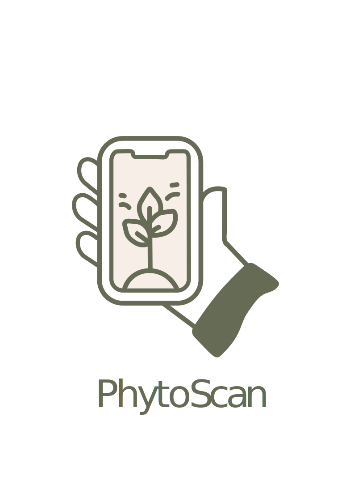

## PhytoScan

Для запуска приложения пожалуйста следуйте инструкциям указанным в следующих репозиториях:

https://github.com/Elena-TKO/iMoscow-Task7-Backend

https://github.com/Elena-TKO/iMoascow-Task7-frontend

**ВНИМАНИЕ!**

Сервер развернут на CPU, заявленные требования
по производительности будут только при тестировании с одного аккаунта!

**ВНИМАНИЕ!**

Протестировать веб-сервис можете по ссылке:

http://130.193.54.130:23000/#/

Инструкция к работе:

https://docs.google.com/document/d/1r0FYY-v-rWhjWLfYn1TxcbdYUvMTJV5VeAMgQk-qinI/edit?tab=t.0